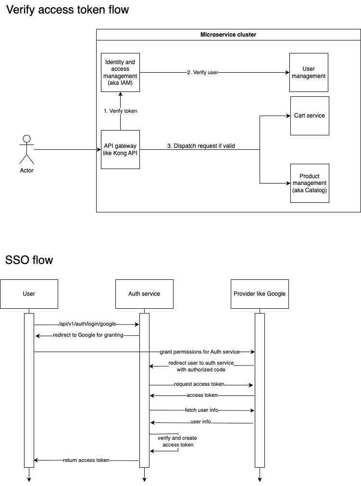

# Dịch Vụ OAuth2

Một dịch vụ xác thực và ủy quyền OAuth2 toàn diện được xây dựng với FastAPI, tích hợp Single Sign-On (SSO), Kiểm soát Truy cập Dựa trên Role (RBAC), và các thực hành bảo mật hiện đại.

## Tính Năng

### Xác Thực & Ủy Quyền
- **Triển khai OAuth2**: Máy chủ ủy quyền OAuth2 đầy đủ với access token và refresh token
- **Đăng nhập một lần (SSO)**: Tích hợp Google OAuth2 với khả năng mở rộng cho các nhà cung cấp khác
- **Kiểm soát Truy cập Dựa trên Role (RBAC)**: Hệ thống quản lý quyền hạn và role linh hoạt
- **Quản lý JWT Token**: Tạo, xác thực và vô hiệu hóa token an toàn
- **Bảo mật Mật khẩu**: Mã hóa BCrypt với salt để lưu trữ mật khẩu an toàn

### Quản lý Người dùng
- **Đăng ký Người dùng**: Đăng ký bằng email/mật khẩu và OAuth
- **Liên kết Tài khoản**: Liên kết nhiều nhà cung cấp OAuth với một tài khoản người dùng
- **Hồ sơ Người dùng**: Quản lý hồ sơ người dùng toàn diện với trạng thái xác minh
- **Kiểm soát Trạng thái Tài khoản**: Kích hoạt/vô hiệu hóa người dùng và xóa mềm

### Giao diện Quản trị
- **Quản lý Role**: Tạo, cập nhật và gán role cho người dùng
- **Quản lý Quyền hạn**: Định nghĩa quyền hạn chi tiết cho các API endpoint
- **Quản trị Người dùng**: Các thao tác CRUD đầy đủ cho quản lý người dùng
- **Gán RBAC**: Gán role cho người dùng và quyền hạn cho role

### Tính năng Bảo mật
- **Vô hiệu hóa Token**: Thu hồi token dựa trên Redis để đăng xuất an toàn
- **Quản lý Phiên**: Xử lý phiên an toàn với middleware
- **Xác thực Đầu vào**: Xác thực request/response dựa trên Pydantic
- **Bảo mật Cơ sở dữ liệu**: PostgreSQL bất đồng bộ với connection pooling

## Kiến Trúc

### Công nghệ
- **Backend**: FastAPI với hỗ trợ async/await
- **Cơ sở dữ liệu**: PostgreSQL với SQLModel/SQLAlchemy ORM
- **Cache**: Redis cho vô hiệu hóa token và quản lý phiên
- **Xác thực**: Authlib cho tích hợp OAuth2
- **Migration**: Alembic cho quản lý schema cơ sở dữ liệu
- **Testing**: Pytest với hỗ trợ async và coverage toàn diện



### Cấu trúc Dự án
```
app/
├── auth/          # Xác thực OAuth2 và SSO
├── users/         # Quản lý người dùng và hồ sơ
├── rbac/          # Kiểm soát Truy cập Dựa trên Role
├── admin/         # Chức năng quản trị
└── core/          # Cơ sở dữ liệu, Redis và cài đặt
```

### Lược đồ Cơ sở dữ liệu
- **Users**: Thông tin người dùng cốt lõi với dữ liệu xác thực
- **Linked Accounts**: Liên kết tài khoản nhà cung cấp OAuth
- **Roles**: Role có tên với mô tả
- **Permissions**: Quyền hạn chi tiết cho API endpoint
- **User Roles**: Gán role cho người dùng (many-to-many)
- **Role Permissions**: Gán quyền hạn cho role (many-to-many)

### API Endpoints

#### Xác thực (`/api/v1/auth`)
- `POST /register` - Đăng ký người dùng bằng email/mật khẩu
- `POST /login` - Xác thực người dùng
- `POST /refresh` - Làm mới token
- `POST /logout` - Đăng xuất an toàn với vô hiệu hóa token
- `GET /me` - Thông tin người dùng hiện tại
- `POST /verify-token` - Xác thực token
- `GET /login/google` - Khởi tạo Google OAuth2
- `GET /callback/google` - Callback Google OAuth2

#### Quản lý Người dùng (`/api/v1/users`)
- Các endpoint quản lý hồ sơ người dùng

#### Quản trị (`/api/v1/admin`)
- `POST /roles` - Tạo role
- `GET /roles` - Liệt kê role với bộ lọc
- `PUT /roles/{id}` - Cập nhật role
- `POST /permissions` - Tạo quyền hạn
- `GET /permissions` - Liệt kê quyền hạn với bộ lọc
- `PUT /permissions/{id}` - Cập nhật quyền hạn
- `POST /users/{id}/roles` - Gán role cho người dùng
- `POST /roles/{id}/permissions` - Gán quyền hạn cho role

### Luồng OAuth2
1. **Yêu cầu Ủy quyền**: Client chuyển hướng đến `/auth/login/google`
2. **Xác thực Nhà cung cấp**: Người dùng xác thực với Google
3. **Xử lý Callback**: Dịch vụ nhận authorization code tại `/auth/callback/google`
4. **Tạo/Liên kết Người dùng**: Tạo người dùng mới hoặc liên kết với tài khoản hiện có
5. **Tạo Token**: Phát hành access và refresh token
6. **Chuyển hướng Client**: Trả token về ứng dụng client

### Triển khai RBAC
- **Quyền hạn Phân cấp**: Quyền hạn định nghĩa quyền truy cập vào API endpoint cụ thể
- **Thành phần Role**: Role là tập hợp các quyền hạn
- **Gán Người dùng**: Người dùng có thể có nhiều role
- **Ủy quyền Động**: Middleware xác thực quyền hạn cho mỗi request

## Phát triển

### Yêu cầu
- Python 3.11+
- PostgreSQL 12+
- Redis 6+
- Trình quản lý gói uv

### Thiết lập
```bash
# Clone repository
git clone <repository-url>
cd oauth2-service

# Cài đặt dependencies
uv sync

# Thiết lập biến môi trường
cp .env.example .env

# Khởi động infrastructure
docker-compose up postgres redis -d

# Chạy migrations
uv run alembic upgrade head

# Seed dữ liệu ban đầu
uv run python seed.py

# Khởi động development server
uv run uvicorn asgi:app --reload
```

### Testing
```bash
# Chạy tất cả tests
uv run pytest

# Chạy với coverage
uv run pytest --cov=app

# Chạy test modules cụ thể
uv run pytest tests/test_auth.py
```

### Triển khai Docker
```bash
# Khởi động tất cả services
docker-compose up -d

# Scale API instances
API_REPLICAS=3 docker-compose up -d
```

## Cấu hình

### Biến Môi trường
- `DATABASE_URL`: Chuỗi kết nối PostgreSQL
- `REDIS_HOST` / `REDIS_PORT`: Chi tiết kết nối Redis
- `SECRET_KEY`: Khóa bí mật cho JWT signing
- `GOOGLE_CLIENT_ID` / `GOOGLE_CLIENT_SECRET`: Thông tin xác thực Google OAuth2
- `ACCESS_TOKEN_EXPIRE_MINUTES`: Thời gian sống của access token
- `REFRESH_TOKEN_EXPIRE_MINUTES`: Thời gian sống của refresh token

### Cấu hình Nhà cung cấp OAuth2
Dịch vụ hỗ trợ tích hợp nhà cung cấp OAuth2 có thể mở rộng. Hiện tại đã triển khai:
- **Google**: Tích hợp OpenID Connect đầy đủ

Có thể thêm các nhà cung cấp khác trong `app/auth/sso_config.py` theo cùng một pattern.

## Cân nhắc Bảo mật

### Quản lý Token
- Access token có thời gian hết hạn ngắn (mặc định: 30 phút)
- Refresh token có thời gian hết hạn dài hơn (mặc định: 7 ngày)
- Vô hiệu hóa token ngăn chặn sử dụng sau khi đăng xuất

### Mô hình Quyền hạn
- Quyền hạn tuân theo pattern REST endpoint: `{METHOD}:{PATH}`
- Kiểm soát chi tiết quyền truy cập API
- Tổng hợp dựa trên role để quản lý dễ dàng hơn

### Bảo vệ Dữ liệu
- Mã hóa mật khẩu với BCrypt
- Ngăn chặn SQL injection thông qua ORM
- Xác thực và làm sạch đầu vào
- Quản lý phiên an toàn

## Tài liệu Tham khảo
- [Hướng dẫn Triển khai OAuth2](https://github.com/magiskboy/oauth2-impl)
- [Phân tích Kỹ thuật Chi tiết](https://www.nkthanh.dev/posts/oauth2)